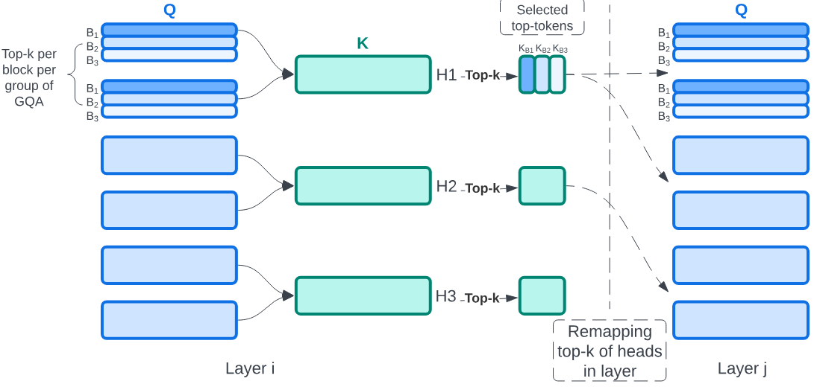

Attention is the dominant source of latency during long-context LLM inference, an increasingly popular workload with reasoning models and RAG. We propose Kascade, a training-free sparse attention method that leverages known observations such as 1) post-softmax attention is intrinsically sparse, and 2) the identity of high-weight keys is stable across nearby layers. Kascade computes exact Top-k indices in a small set of anchor layers, then reuses those indices in intermediate reuse layers. The anchor layers are selected algorithmically, via a dynamic-programming objective that maximizes cross-layer similarity over a development set, allowing easy deployment across models. The method incorporates efficient implementation constraints (e.g. tile-level operations), across both prefill and decode attention. The Top-k selection and reuse in Kascade is head-aware and we show in our experiments that this is critical for high accuracy. Kascade achieves up to 4.1x speedup in decode attention and 2.2x speedup in prefill attention over FlashAttention-3 baseline on H100 GPUs while closely matching dense attention accuracy on long-context benchmarks such as LongBench and AIME-24.

[Code](https://github.com/microsoft/kascade)
